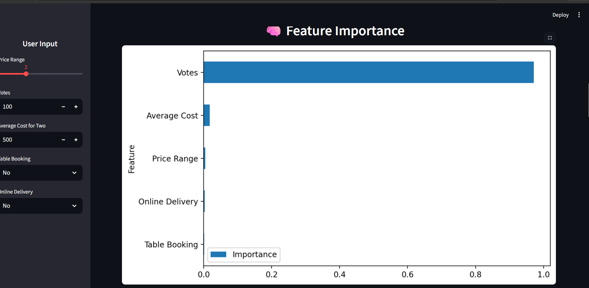
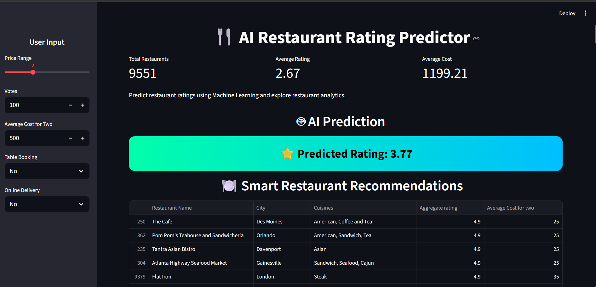
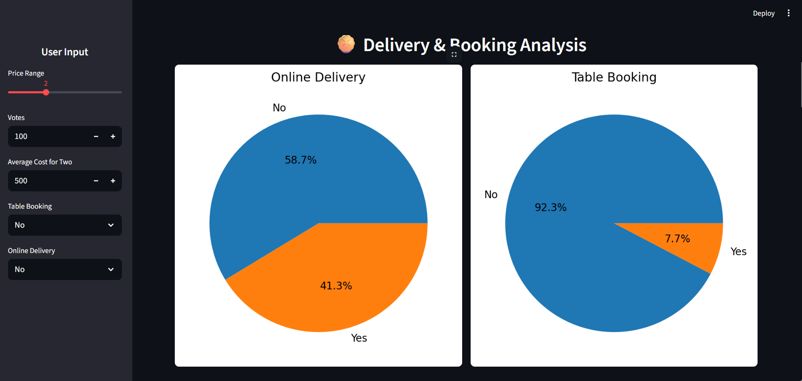
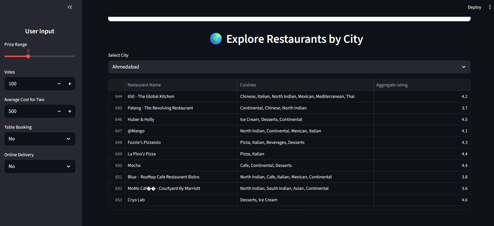

# 🍴 AI Restaurant Rating Predictor

An advanced Machine Learning and Streamlit-based web application for predicting restaurant ratings and exploring restaurant analytics.

---

# 📌 Project Overview

This project is a complete Data Science and Machine Learning solution developed using Python, Streamlit, and Scikit-learn.

The application predicts restaurant ratings based on different restaurant features and also provides dynamic restaurant analytics, visualizations, and smart recommendations.

This project was developed as part of a Data Science Internship project and later upgraded into a professional AI-powered analytics dashboard.

---

# 🚀 Features

## ✅ Machine Learning Prediction
- Predict restaurant ratings using AI/ML models
- Real-time prediction system

## ✅ Interactive Dashboard
- Dynamic charts and analytics
- Responsive Streamlit UI

## ✅ Restaurant Recommendations
- Smart filtered recommendations
- Top-rated restaurants display

## ✅ Dynamic Analytics
- City-wise analysis
- Cuisine analysis
- Rating distribution analysis
- Delivery & booking analysis

## ✅ Feature Importance
- Shows the impact of each feature on predictions

---

# 🧠 Machine Learning Model

The project uses:

## 🌲 Random Forest Regressor

The model predicts restaurant ratings using the following features:

- Price Range
- Votes
- Average Cost for Two
- Table Booking
- Online Delivery

---

# 📊 Technologies Used

| Technology | Purpose |
|---|---|
| Python | Core Programming |
| Streamlit | Web Application |
| Pandas | Data Analysis |
| Matplotlib | Data Visualization |
| Scikit-learn | Machine Learning |
| Pickle | Model Serialization |

---

# 📁 Project Structure

```bash
Restaurant-Rating-Analysis-and-Prediction/
│
├── models/
│   └── restaurant_model.pkl
│
├── app.py
├── main.py
├── Dataset .csv
├── requirements.txt
├── README.md
│
├── level1.ipynb
├── level2.ipynb
└── level3.ipynb
```

---

# ⚙️ Installation & Setup

## 1️⃣ Clone Repository

```bash
git clone YOUR_REPOSITORY_LINK
```

---

## 2️⃣ Move to Project Folder

```bash
cd Restaurant-Rating-Analysis-and-Prediction
```

---

## 3️⃣ Install Dependencies

```bash
pip install -r requirements.txt
```

---

# ▶️ Run the Application

```bash
streamlit run app.py
```

---

# 📈 Dashboard Functionalities

## 🔹 AI Rating Prediction
Predict restaurant ratings instantly using Machine Learning.

## 🔹 Smart Recommendations
Displays top restaurants according to selected filters.

## 🔹 Dynamic Pie Charts
- Online delivery analysis
- Table booking analysis

## 🔹 City-wise Analytics
Explore restaurant distribution across cities.

## 🔹 Cuisine Analysis
Analyze top cuisines dynamically.

## 🔹 Rating Distribution
Visual representation of restaurant ratings.

---

# 📸 Screenshots

## 🖥️ Dashboard



---

## 🤖 Prediction Output



---

## 📊 Analytics



---

## 🍽️ Recommendations




# 🎯 Results

- Achieved high prediction accuracy using Random Forest Regressor
- Built a fully interactive AI-powered dashboard
- Developed a deployable Streamlit web application

---

# 🌐 Future Improvements

- Login & Authentication System
- Database Integration
- Google Maps Integration
- Restaurant Recommendation AI
- Cloud Deployment
- Mobile Optimization

---

# 👨‍💻 Author

## Abhinav Kumar Gupta

Data Science & Machine Learning Enthusiast